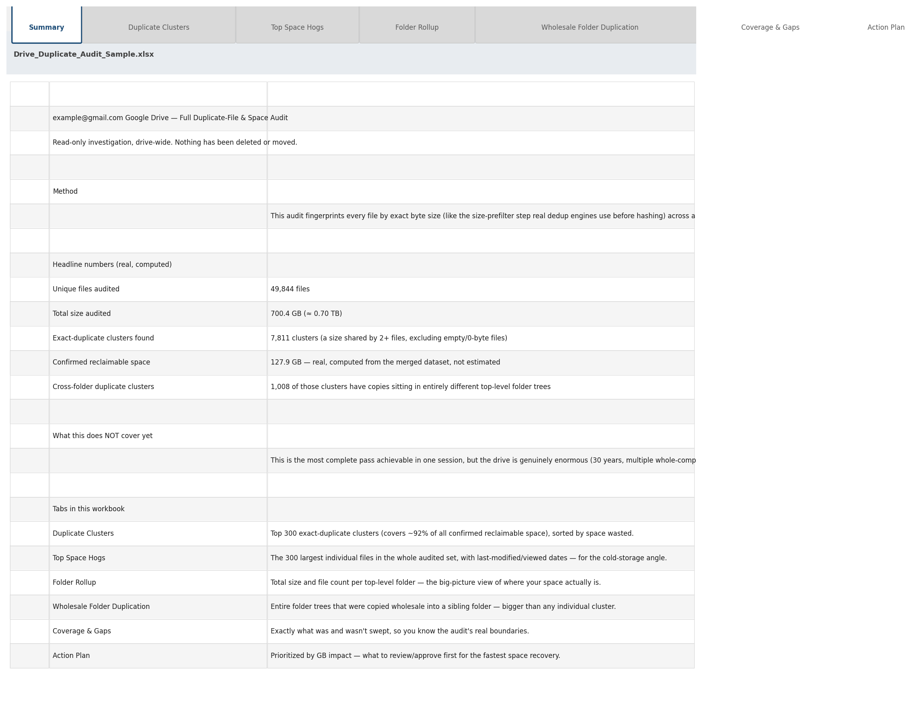
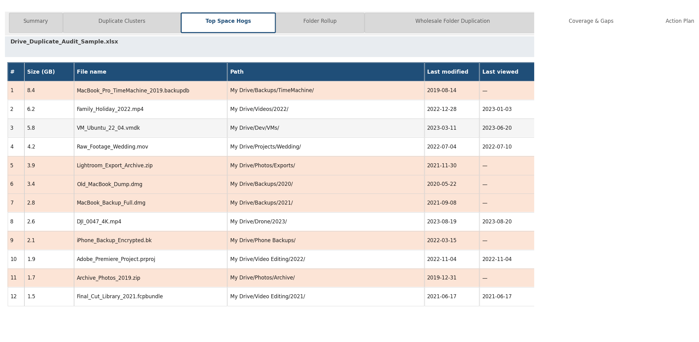
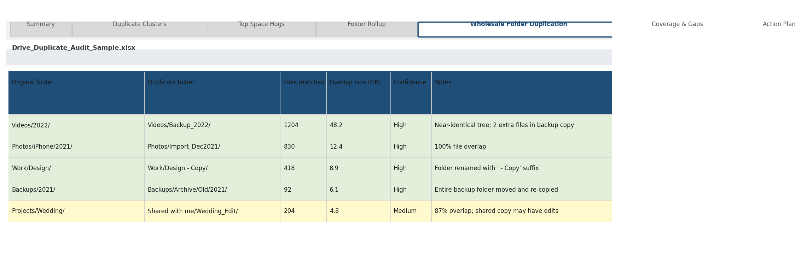
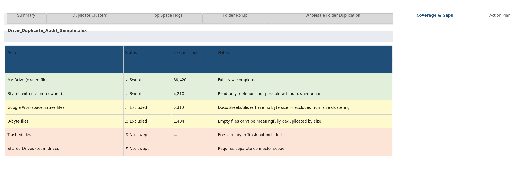
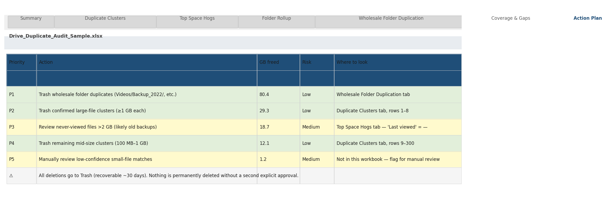

# Smart Maya Tidy

A free, open-source [Claude Skill](https://docs.claude.com/en/docs/build-with-claude/skills) that audits a
Google Drive account for duplicate files and storage bloat, produces a clear report before touching
anything, and only removes files after explicit, itemized approval — moving them to Trash, never
permanently deleting.

Built by [Smart Maya](https://smartmaya.ai).

## Who this is for

Small and mid-sized business owners and teams whose Google Drive has grown for years without ever
being audited — old employee backups, migrated folders, exported photo/video libraries, and
duplicated project directories that quietly eat into storage quotas. This skill is built for people
who want that resolved by asking their AI assistant in plain language, not by hiring a consultant or
learning a new tool.

## Why it matters

- **No new tool to learn.** It runs inside Claude, wherever the Google Drive connector is already
  enabled — there's no separate dashboard, login, or install.
- **No subscription.** MIT-licensed and free to use or adapt.
- **Nothing is deleted without sign-off.** Every action is reported first, approved explicitly, and
  reversible (Trash, not permanent deletion).
- **Built to avoid false positives.** Duplicate matches are confidence-tiered so that small,
  unrelated files with a coincidental size match are never auto-actioned — only flagged for manual
  review.

## Use cases

- **Storage cost avoidance** — reclaim space instead of paying for the next Google Workspace storage
  tier.
- **Pre-migration cleanup** — de-clutter before moving to a new domain, a new Drive, or a different
  storage provider.
- **Offboarding and consolidation** — merge or clean up Drive contents left behind after a hire,
  departure, or team restructuring.
- **Media library dedup** — shared photo/video folders that have been exported or extracted more
  than once.
- **Records visibility** — a clear picture of what's actually in the Drive before a compliance,
  audit, or backup-strategy review.

## Methodology

This applies a core idea used by professional deduplication and backup systems — fingerprint content
and bucket by that fingerprint instead of comparing every file to every other file, so the process
runs in roughly linear time rather than quadratic:

1. **Enumerate everything.** Every file in the Drive, not just one folder, via the Google Drive
   connector.
2. **Fingerprint by exact byte size.** A byte-for-byte size match between two files in unrelated
   folders is a strong duplication signal for any file above a trivial size. This is the same
   size-prefilter dedup engines use before the more expensive step of full content hashing.
3. **Confidence-tier the matches.** Files ≥100KB, or smaller files whose names are clear variants of
   each other, are treated as high-confidence. Smaller files with unrelated names are set aside for
   manual review rather than auto-actioned, since coincidental byte-size collisions are possible at
   very small sizes.
4. **Report before any action.** An XLSX audit — duplicate clusters ranked by reclaimable space, the
   largest individual files, and a folder-level breakdown of where space is concentrated.
5. **Approve, then remove in batches.** Nothing is deleted until the owner reviews the report and
   approves specific items. Removal happens in small, visible batches to Trash — recoverable for
   about 30 days.

   Here's what that report actually looks like — the **Duplicate Clusters** tab (exact file IDs, with a
   recommended keep/trash split per cluster) and the **Folder Rollup** tab (where space is concentrated,
   at a glance):

   <p float="left">
     
    
  </p>

## Scope & limitations

- Duplicate detection is based on exact file-size fingerprinting plus filename-pattern matching, not
  full cryptographic content hashing of every file. This makes it fast enough to run against a full
  account in one sitting, and is well-suited as a first-pass audit and triage tool.
- It is not equivalent to enterprise block-level deduplication systems (e.g. content-defined chunking
  with inline cryptographic hashing on dedicated storage hardware). Organizations needing
  forensic-grade, byte-verified duplicate proof at petabyte scale should use a purpose-built
  enterprise dedup or backup platform instead.
- Recommended for accounts up to the low hundreds of thousands of files; very large accounts may
  need the crawl split across multiple sessions.
- Google-native documents (Docs, Sheets, Slides) have no byte size and are excluded from
  size-based clustering.

## Results from testing

In an end-to-end test run against a real Google Drive account (~50,000 files, ~700GB), this
methodology identified **127.85GB of confirmed, high-confidence reclaimable duplicate storage across
7,811 clusters — approximately 18% of total storage audited.**



## Example report

The XLSX report Claude hands back has seven tabs. Beyond the Summary, Duplicate Clusters, and Folder
Rollup shown above:

- **Top Space Hogs** — the largest individual files, useful even outside exact duplicates (old backups
  that just never got cleaned up).
- **Wholesale Folder Duplication** — entire folder trees that were copied wholesale into a sibling
  folder, which is often a bigger win than dedup at the individual-file level.
- **Coverage & Gaps** — exactly what was and wasn't swept, so the audit's real boundaries are explicit
  rather than implied.
- **Action Plan** — every finding prioritized by GB impact, so approving cleanup is a quick
  top-to-bottom pass instead of hunting through tabs.

<p float="left">
  
  
</p>
<p float="left">
  
  
</p>

## Install

Drop this repository's contents into your Claude Skills directory (or upload it wherever your Claude
client — Claude Code, Cowork, etc. — loads project/personal skills from). The skill activates when
you ask about a full Google Drive, duplicate files, or freeing up space, provided your Claude session
has a Google Drive connector (MCP) enabled.

**Prerequisite:** a Google Drive connector (MCP) must already be enabled in your Claude session. This
is a one-time setup step if it isn't already configured.

## Use

Talk to Claude naturally: *"My Google Drive is nearly full, can you find what's duplicated?"* Claude
enumerates the Drive, runs the clustering analysis (`scripts/dedupe_drive.py`), and returns an XLSX
report. Nothing is touched until the report is reviewed and specific items are approved for removal.

The analysis script can also be run standalone against a JSONL export of file metadata:

```bash
python3 scripts/dedupe_drive.py --input files.jsonl --out report.xlsx
```

`files.jsonl` is one JSON object per line with at minimum `id`, `title`, `fileSize`, `path`,
`createdTime`. See `SKILL.md` for the exact field expectations and how an agent should gather this
from a live Drive connector.

## Safety & compliance

- Read-only until a report has been delivered and specific items have been explicitly approved.
- Removal always goes to Trash — never a permanent delete.
- Low-confidence (small file, unrelated name) matches are flagged for manual review and are never
  auto-actioned.
- Bulk removal is performed in small, visible batches rather than one unattended mass operation.

## License

MIT — see `LICENSE`. Contributions welcome.
