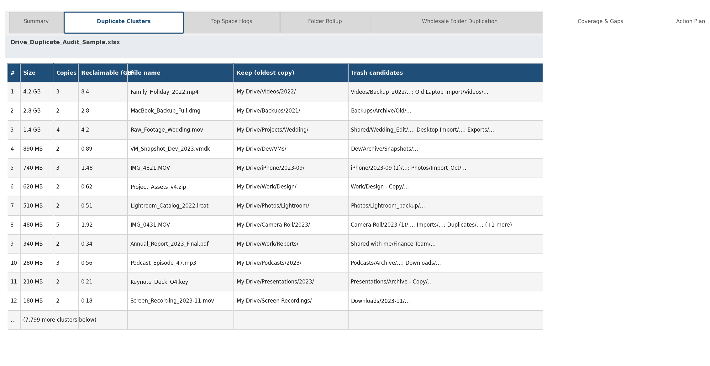
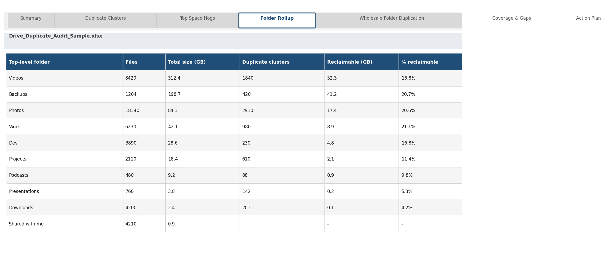

# Smart Maya Tidy

A free, open-source [Claude Code skill](https://docs.claude.com/en/docs/build-with-claude/skills) that audits Google Drive for likely duplicate files and storage bloat.

It produces a reviewable XLSX report and is **read-only**: it does not delete, move, rename, or modify Drive files.

Built by [Smart Maya](https://smartmaya.ai).

## Who this is for

Small and mid-sized business owners and teams whose Google Drive has grown for years without a clear inventory — old employee backups, migrated folders, exported media libraries, and duplicate project directories.

Use it when you need a clear, decision-ready view of what may be duplicated before choosing any cleanup approach.

## What it does

- Enumerates available Google Drive file metadata through a configured connector.
- Groups likely duplicates using exact byte-size fingerprints and filename patterns.
- Ranks findings by potential space impact and confidence.
- Exports an XLSX report with duplicate clusters, folder rollups, large files, coverage notes, and an action plan.

## Safety boundary

Smart Maya Tidy is an audit and reporting tool only.

- No files are deleted, moved, renamed, or altered.
- No cleanup action is performed from this skill.
- Low-confidence matches are marked for review, not treated as confirmed duplicates.
- Treat every result as a recommendation: verify important findings before taking action elsewhere.

## Scope and limitations

- Duplicate detection uses file size and filename patterns, not cryptographic content hashing.
- Google-native Docs, Sheets, and Slides have no byte size and are excluded from size-based clustering.
- It is designed as a first-pass audit and triage tool, not a forensic or enterprise deduplication system.
- Very large accounts may need to be reviewed in multiple sessions.

## Example report

The XLSX report includes:

- **Summary** — audit coverage and key totals.
- **Duplicate Clusters** — likely duplicate groups, confidence, and estimated space impact.
- **Folder Rollup** — where storage is concentrated.
- **Top Space Hogs** — large individual files worth reviewing.
- **Wholesale Folder Duplication** — likely copied folder trees.
- **Coverage & Gaps** — what was and was not included.
- **Action Plan** — findings ordered by potential impact.





## Install

Copy this repository into your Claude Code skills directory, or add it through the [Smart Maya skills marketplace](https://github.com/WiselyWise/smartmaya-skills).

A Google Drive connector (MCP) must already be enabled in your Claude session for a live Drive audit.

## Use

Ask Claude naturally:

> My Google Drive is nearly full. Audit likely duplicate files and give me a report.

Claude runs the analysis and returns an XLSX report. Review the report, then decide on any follow-up outside this skill.

The analysis script can also run against a JSONL export of file metadata:

```bash
python3 scripts/dedupe_drive.py --input files.jsonl --out report.xlsx
```

See [SKILL.md](SKILL.md) for expected fields and workflow instructions.

## License

MIT — see [LICENSE](LICENSE).
